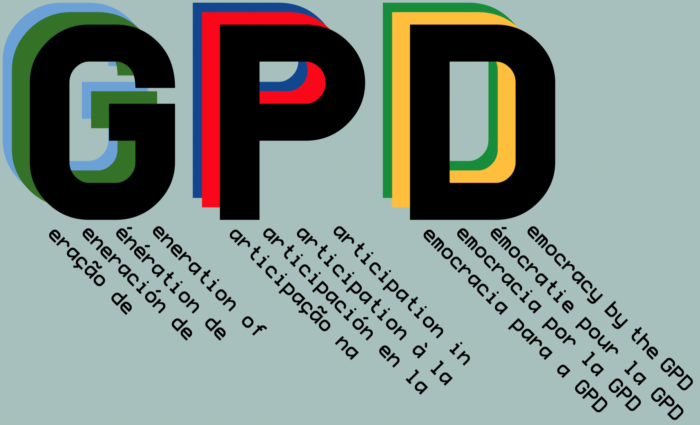

<h1 id="brand-title">Generation of Participation in Democracy (GPD)</h1>
<h2 id="brand-subtitle">A Sustainable Operating System for the Americas</h2>

<strong>Public Benefit Mission.</strong> GPD is a California Public Benefit Corporation advancing sustainable, participatory societies across the Americas. Our specific public benefit is to strengthen democratic capacity, public health, and institutional resilience through integrated social science, technology, and field-based collaboration.

<strong>Transparency.</strong> Meaningful democratic participation requires transparency. GPD operates under a principle of radical transparency wherever possible—making methods, data practices, and institutional decisions legible and accountable to the communities we serve.

We scale efforts aligned with the United Nations <a href="https://sdgs.un.org/goals">Sustainable Development Goals</a>, focusing on the foundations of participation: access to essential resources, reliable information, and secure institutions.

<h3>Indigenous Public Health — Instituto Dourados</h3>

Our first Flagship Institute, the <a
href="https://institutodourados.org">Instituto Dourados</a>, develops and
deploys public health systems in collaboration with Indigenous communities,
integrating epidemiology, social science, and multilingual knowledge
sharing.

<h3>Education and Digital Security</h3>

We design educational systems and privacy-first technologies that enable
institutions to analyze sensitive data locally, maintaining data sovereignty
while supporting real-time decision-making.

<h3>Corporate Information</h3>

<strong>Legal Structure:</strong>  California Public Benefit Corporation 
<strong>IRS Employer Identification Number (EIN):</strong>  41-4992916 
<strong>Transparency inquiries/concerns:</strong>  <a href="mailto:transparency@gpdamericas.org">transparency@gpdamericas.org</a>

 

{width=450px fig-align="center" #anchor}

<h3>Founder’s Statement</h3>

GPD is built to move from theory to implementation—combining research,
infrastructure, and education to support sustainable futures across the
Americas.

{.float-left height=210px} 

<em>In solidarity and service,</em>

{width=200px}

<strong>Matt Turner, PhD</strong>

Founder & Architect, GPD Américas

<a href="mailto:matt@mat.phd">Contact</a>

