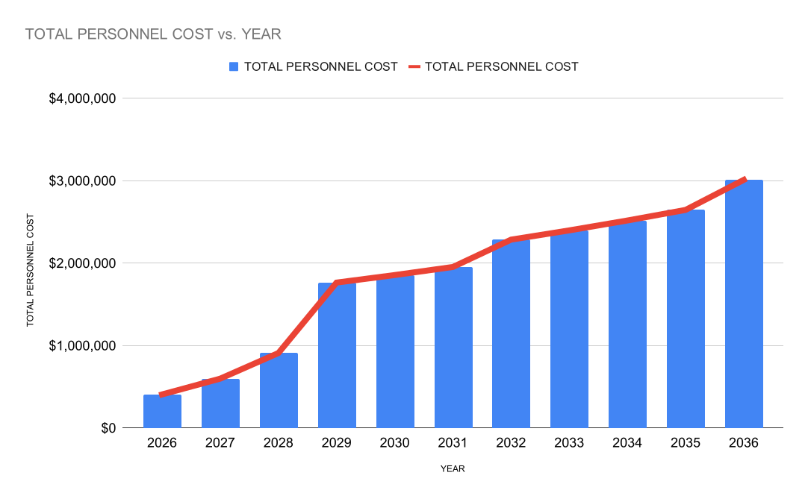

## Flagship Plan for 2026-27 and 2026-2036

Instituto Dourados ([institutodourados.org](https://institutodourados.org)) 
is the Flagship Institute of the Generation of Participation
in Democracy (GPD). 

As a Flagship, it serves as a primary site of development,
testing, and deployment—where research, infrastructure, and field collaboration
are integrated into working systems. 

The goal is not only to study sustainable
participation, but to build and validate it in practice.

Further worksheet details such as travel arrangement budgeting are publicly
available as a Google Sheet: [BUDGET - LAUNCH - INSTITUTO
DOURADOS](https://docs.google.com/spreadsheets/d/1gdWVrJpWXlZVfzygsjTp1xVc7yRpUXZq2SB77ctCBTg/edit?usp=sharing).

Please see the [_Success Scenarios_](https://docs.google.com/spreadsheets/d/1gdWVrJpWXlZVfzygsjTp1xVc7yRpUXZq2SB77ctCBTg/edit?gid=1702619168#gid=1702619168)
that show two possible combinations of donor types and amounts to reach our
budget goals this year and next.

For donations less than \$1000, please donate to our current fundraising sprint
to _**avoid founder burnout**_ via GoFundMe:

For larger gifts, please contact our Giving team to make arrangements.

- **GPD Américas — Giving**  
  [giving@gpdamericas.org](mailto:giving@gpdamericas.org)

The Generation of Participation in Democracy is a nonprofit California Public
Benefit Corporation with 501(c)(3) tax exemption pending approval (IRS Employer
Identification Number 41-4992916). Please [see our Corporate
Information](index.qmd) on our Mission page for more details.

## Purpose and Plan for 2026–2027

This budget bridges Instituto Dourados from its current startup phase to
autonomous operation with a 5-10 year operating endowment beginning January 2027.
More details and links to our ten-year scale-up spreadsheet can be found below
in the section [Ten-Year Budget to Scale Human
Resources](#ten-year-budget-to-scale-human-resources).

The 2026 bridge year prioritizes:

- Director capacity (research, operations, and fundraising)
- Field integration with Brazilian partners
- Institutional visibility through conferences and collaboration
- Publication and educational infrastructure
- Long-term sustainability planning

The objective for Instituto Dourados is to become a self-sustaining research
exchange program by 2027. In 2027 we will expand staffing to support more student
intern trainees and add a new field site, likely in the state of Bahia.

_Self-sustaining_ here means the Instituto's endowment reaches a level
to guarantee 5-10 years of a growth-oriented budget. For details, see the
publicly-available Google Sheet within our launch budget file, ["Ten-year Human
Resources
Projection"](https://docs.google.com/spreadsheets/d/1gdWVrJpWXlZVfzygsjTp1xVc7yRpUXZq2SB77ctCBTg/edit?gid=1145667153#gid=1145667153).

## 2026 Bridge Budget

This budget enables:

- Three field visits to Brazil in 2026 (Q2–Q4)
- Conference participation and partner coordination
- On-site collaboration and exchange programming
- Focused time allocation for institutional buildout

The 2026 bridge year is designed to:

- Establish recurring funding streams
- Expand partnerships and institutional visibility
- Support initial hiring and program growth

| Category   | Item            | Description                   | Cost     |
|------------|-------------------|-------------------------------|----------|
| Personnel  | Dr. Rezende     | 9 Mo. @ $150k/yr, .2 FTE | $23k  |
| Personnel  | Dr. Turner      | 9 Mo. @ $150k/yr  | $113k |
| Personnel  | Benefits/Tax    | 25% Burden     | $34k  |
| Operations | Field Sprints   | Dourados, Bahia, MedTrop      | $38k  |
| Operations | Legal/Insurance | One-time/once-yearly          | $36k  |
| |  **TOTAL**  | _Above plus gross-up_ | **$248k** |

### 2026 Q2 Sprint Allocation and Operational Sequence

The immediate Q2 2026 sprint budget is designed to stabilize core organizational operations, support continuity of leadership and collaboration, and enable the next phase of publication, fundraising, and field coordination activity.

This sprint sequence prioritizes:

- continuity of institutional labor already performed during the startup phase
- stabilization of director capacity
- launch-phase fundraising and publication infrastructure
- preparation for field coordination activities in Brazil
- operational continuity through Q3 and Q4 2026

#### Q2 Operational Sequence

The current sprint sequence proceeds in the following order:

1. Retroactive compensation for Dr. Turner covering $\approx\frac{1}{2}$
   Q2 2026 labor already performed (as of May 14, 2026):
   - organizational formation and compliance:
      - incorporated Generation of Participation in Democracy as California Public Benefit Corporation
      - acquired IRS Employer Identification Number, EIN: 41-4992916
      - submitted IRS Form 1023 
   - website development ([institutodourados.org](https://institutodourados.org) and [gpdamericas.org](https://gpdamericas.org))
   - fundraising preparation and other institutional administration (GoFundMe,
     GPD bank account, budgets and forecasts)
   - wrote three new mini-projects for intern training

2. Retroactive compensation for Dr. Rezende covering 
   $\approx\frac{1}{2}$ Q2 2026 labor already performed in support of:
   - Brazilian partner coordination (meetings with UFGD faculty partners Profs.
     Simone Simionatto and Matheus Hernandez)
   - communications and recruitment (recruited and onboarded our new Executive
     Science Intern, Manjari Mishra)

3. Allocation of remaining $\approx\frac{1}{2}$ Q2 salary support for Drs.
   Rezende and Turner

5. Purchase of travel, lodging, operational support, and insurance for the July 2026 Reunião de Juninho field sprint (anticipated July 10–20, 2026).

This field sprint supports:

- collaborative planning
- institutional relationship development
- sustainability and public health engagement
- field documentation and publication
- long-term exchange infrastructure

Fundraising for this sprint will be done through a specific [GoFundMe
fundraiser](https://gofund.me/cb94dd44a).

#### Accounting for GoFundMe 2.9% fee

GoFundMe takes a 2.9% cut from all funds, so to calculate the gross amount
needed to obtain the goal amount to cover Q2 as the net, we need to _gross up_
our stated GoFundMe fundraising goal. Net and gross are related as follows:

\begin{align}
\mathrm{Net} & = \mathrm{Gross} - (\mathrm{PctFee} \times \mathrm{Gross}) \\
             & = \mathrm{Gross} \times (1 - \mathrm{PctFee})
\end{align}

We need to know $\mathrm{Gross}$, which we solve for by dividing $\mathrm{Net}$
by $(1 - \mathrm{PctFee})$, 

$$
\mathrm{Gross} = \frac{\mathrm{Net}}{(1 - \mathrm{PctFee})}.
$$

We arrive at the following tabular calculation of the Q2 Sprint Budget.
Directors salary for this current bridge year, 2026, is \$150/yr FTE. This is 
\$37.5k/quarter. Spending goes first to the directors to be able to continue the
work, backfilling pay for Q2 that they have foregone for the sake of launching.
Back pay in situations like these prevents founder burnout.

As funds arrive, the directors will first receive back pay for the first half
of Q2. Dr. Rezende is working at 20\% FTE; Dr. Turner is working full time. 
The directors will be reimbursed for their efforts first, then their salary for
the rest of Q2 will be set aside. 

Once Q2 salaries are covered, we will allocate incoming funds towards
the necessary insurance and legal representation for developing international
educational travel and social service programs like ours.

The final step in the Q2 sprint is to raise enough money to fund our first
_reunião_ to travel to Brazil to introduce
our latest recruits, Assistant Executive Scientist Manjari Mishari and Junior Infrastructure Intern 
[Mariana Barreto Alcantara](https://institutodourados.org/pt/#mariana-barreto-alcantara-estagi%C3%A1ria-de-pesquisa-j%C3%BAnior) to meet their Brazilian
counterparts and academic partners in Dourados, plus tour the Reserva and
hospital systems. 

#### Q2 Sprint Budget Table

| Category   | Item               | Description                | Amount |
|------------|--------------------|----------------------------|---------|
| Personnel  | Dr. Turner         | Retroactive first 1/2 Q2   | $19k |
| Personnel  | Dr. Rezende        | Retroactive first 1/2 Q2   | $3k |
| Personnel  | Dr. Turner         | Remaining Q2               | $19k |
| Personnel  | Dr. Rezende        | Remaining Q2               | $3k |
| Personnel  | Benefits/Tax       | Estimated 25% burden       | $11k |
| Operations | Insurance/Legal    | Yearly/One-time            | $35k  |
| Operations | Julho Reunião      | Travel, lodging, per-diem  | $18k |
|            |                    | **TOTAL SPEND (Net)**      | **$109k** |
|            |                    | _GoFundMe Fee_             | _2.9%_     |
|            |                    | **GOAL TOTAL (Gross)**     | **$112k** |

 

This sprint allocation forms the operational bridge into the broader 2026 bridge
budget described below and is intended to establish stable momentum entering Q3
and Q4 2026.

In Q3 and Q4 2026 the directors will travel to Brazil to work with our UFGD
interns in person and to network and fundraise in Brazil, with a focus on Bahia
and MedTrop in Brasilia, which may present a unique networking opportunity with
federal government connections. 

By a similar calculation with $10k for each directors' visit we budget $66k for
Q3 and Q4 2026 (see teal block at top of [this
sheet](https://docs.google.com/spreadsheets/d/1gdWVrJpWXlZVfzygsjTp1xVc7yRpUXZq2SB77ctCBTg/edit?gid=1427209452#gid=1427209452)).

For Q3 and Q4 the budget is $66k net total, which becomes $68k when grossed up
if we continue to use GoFundMe.

### **Grand Total for 2026, assuming GoFundMe:** 

$\text{Total} = \text{Q2} + \text{Q3} + \text{Q4} = \$112\text{k} + \$68\text{k} + \$68\text{k} =
\$248\text{k}$

## 2027 First Full Year of Full-Time Operation

Beginning January 2027, Instituto Dourados transitions to full-time directorship 
and autonomous operation.

### 2027 First-Year Operating Budget

| Category   | Item            | Description            | Cost  |
|------------|-----------------|------------------------|-------|
| Personnel  | Dr. Rezende     | $200k/yr               | $200k |
| Personnel  | Dr. Turner      | $200k/yr               | $200k |
| Personnel  |Senior Intern    | $20/hr .25FTE          | $10.4k  |
| Personnel  | Senior Intern   | $20/hr .25FTE          | $10.4k  |
| Personnel  | Benefits/Tax    | 25% Burden             | $105.2k |
| Operations | Field Visits    | California             | $27k |
| Operations | Collaboration   | Bahia; Brazil Workshop | $27k  |
| **TOTAL**  |                 |                        | **$580k** |

## Ten-Year Budget to Scale Human Resources

The final component of our budget planning for Instituto Dourados is a ten-year
personnel budget designed to build out our org chart
([link to 10-year forecast](https://docs.google.com/spreadsheets/d/1gdWVrJpWXlZVfzygsjTp1xVc7yRpUXZq2SB77ctCBTg/edit?gid=1145667153#gid=1145667153)). 

It establishes a
cost-of-living adjustment (COLA) plus a yearly raise for
employees in good standing receive that component of the raise.

It formalizes our plans to add assistant directors, senior interns, and both 
senior and junior program success officers. We estimate that by 2036 we will
have 24 paid staff members, with 16 interns. 

This budget will need an update to account for various levels of _Executive
Scientist_, a role that resembles traditional research scientist roles, but with
additional business and operational responsibilities, with perhaps fewer direct
reports compared to other roles in industry or elsewhere.

Yearly raises consistent with other Silicon Valley and Californian nonprofits,
and competitive with private companies, will attract top talent to junior 
leadership positions. There they can gain experience through mentorship, earning
seniority through guided professional development programs.

A conservative estimate for our yearly operating budget by year 2036 is $3M.
Our first ten years will require a total endowment of at least $20M.

<!--  -->
